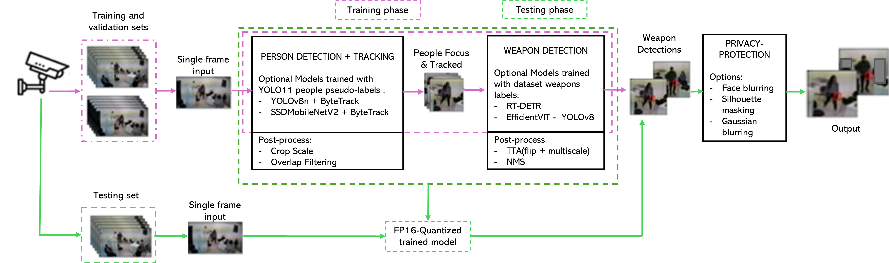

# Lightweight Modular Real-Time Weapon Detection Framework for Edge Deployment Optimization

[](https://www.python.org/downloads/)
[](https://pytorch.org/)
[](https://opensource.org/licenses/MIT)
[](https://developer.nvidia.com/cuda-toolkit)

**A Lightweight Modular Real-Time Weapon Detection Framework Using Advanced Computer Vision Techniques for Edge Deployment Optimization**

[Overview](#abstract) •
[Architecture](#architecture) •
[Installation](#installation) •
[Quick Start](#quick-start) •
[Results](#results) •
[Citation](#citation)

---

## Abstract

Gun violence remains a persistent public safety crisis, driving urgent demand for automated threat detection systems capable of identifying weapons before violence occurs. Existing weapon detection approaches face a fundamental tension: lightweight models optimized for edge deployment sacrifice accuracy on small or occluded weapons, while high-accuracy transformer architectures impose computational demands incompatible with real-time surveillance. Furthermore, prior work largely ignores temporal consistency through multi-object tracking and privacy preservation required for regulatory compliance, limiting practical deployability.

This repository implements a **lightweight modular real-time weapon detection framework** addressing these gaps. The architecture decomposes detection into independently optimizable stages:

1. **Person Detection + Tracking** using YOLOv8n + ByteTrack
2. **Weapon Detection** within person-centric regions using EfficientViT-YOLOv8
3. **Privacy Protection** with selective face anonymization for GDPR compliance

The complete framework (**YOLOv8n + EfficientViT-YOLOv8**) achieves **0.679 mAP50** at **13.8 FPS** on the NVIDIA A100 evaluation platform, representing **13.2% accuracy improvement** over state-of-the-art YOLOv8m-SR (0.60 mAP50) on the WeaponSense dataset while maintaining favorable computational efficiency for edge deployment.

### Key Achievements

| Metric | Result | Description |
|--------|--------|-------------|
| **mAP@0.5** | 0.679 | Overall detection accuracy |
| **Person-Centric Improvement** | +21.4pp (+46% relative) | vs full-frame detection |
| **False Positive Reduction** | 70.5% | Through hierarchical NMS processing |
| **Architecture Efficiency** | 8x reduction | EfficientViT-YOLOv8 vs RT-DETR computational cost |
| **State-of-the-Art Gain** | +13.2% | vs YOLOv8m-SR baseline (0.60 → 0.679) |
| **Privacy Overhead** | 2.2% | GDPR-compliant selective face blurring |
| **Privacy Accuracy Impact** | 0pp | No detection accuracy loss |

### Hypothesis Validation Summary

**8 of 11 hypotheses (72.7%) received empirical support:**

| RQ | Hypothesis | Threshold | Result | Status |
|----|------------|-----------|--------|--------|
| RQ1 | H1.1 Person-centric cropping | ≥5pp mAP50 | **+21.4pp** | SUPPORTED |
| RQ1 | H1.2 Hierarchical NMS | ≥20% FP reduction | **70.5%** | SUPPORTED |
| RQ1 | H1.3 Optimal crop scale | [1.0, 1.5] | **1.8 optimal** | NOT SUPPORTED |
| RQ2 | H2.1 RT-DETR parity | ≥0pp vs EfficientViT-YOLOv8 | **-2.3pp** | NOT SUPPORTED |
| RQ2 | H2.2 EfficientViT-YOLOv8 efficiency | ≥99% @ ≤70% cost | **108.5% @ 12.5%** | SUPPORTED |
| RQ2 | H2.3 RT-DETR knife advantage | ≥2pp differential | **EfficientViT-YOLOv8 +14.7pp** | NOT SUPPORTED |
| RQ2 | H2.4 Real-time throughput | ≥10 FPS | **12.2 & 13.8 FPS** | SUPPORTED |
| RQ3 | H3.1 Tracking GFLOPs reduction | ≥33% @ ≥-2pp | **8.1% max** | NOT SUPPORTED |
| RQ3 | H3.2 Tracking FPS improvement | ≥30% @ ≥-2pp | **30.4% @ gap=3** | SUPPORTED |
| RQ4 | H4.1 Privacy overhead | ≤5% | **2.2%** | SUPPORTED |
| RQ4 | H4.2 Privacy accuracy | ≤2pp loss | **0pp** | SUPPORTED |

---

## Key Contributions

| # | Contribution | Research Question |
|---|--------------|-------------------|
| 1 | **Modular Pipeline Architecture** — Hierarchical detection with person-centric cropping achieving +21.4pp mAP50 improvement | RQ1 |
| 2 | **Architecture Comparison** — EfficientViT-YOLOv8 outperforms RT-DETR (+6.7pp mAP50) while using 8x less computation | RQ2 |
| 3 | **Temporal Tracking Integration** — ByteTrack enables 30.4% FPS improvement via frame skipping at gap=3 | RQ3 |
| 4 | **Privacy-Preserving Detection** — Selective face blurring with 0pp accuracy loss and 2.2% overhead | RQ4 |

---

---

## Architecture



*Figure: Overview of the modular framework with person detection and tracking, weapon detection, and integrated privacy-preserving module*

### Person Detection + Tracking

| Component | Model | GFLOPs | Purpose |
|-----------|-------|--------|---------|
| Detector | YOLOv8n | 8.7 | Real-time person detection |
| Alternative | SSD-MobileNetV2 | 3.4 | Ultra-lightweight option |
| Tracker | ByteTrack | ~0.1 | Multi-object tracking & frame skipping |

**Post-processing:** Crop Scale (1.8x optimal), Overlap Filtering

### Weapon Detection

| Architecture | Type | GFLOPs | mAP@0.5 | Recommendation |
|--------------|------|--------|---------|----------------|
| **EfficientViT-YOLOv8** | CNN-Transformer Hybrid | 6.2 | **0.679** | **Edge deployment** |
| RT-DETR | Pure Transformer | 81.4 | 0.612 | High-compute scenarios |

**Post-processing:** TTA (flip + multiscale), NMS (Local + Global)

> **Key Finding**: EfficientViT-YOLOv8 achieves **108.5%** of RT-DETR's accuracy at only **12.5%** of the computational cost — an **8x efficiency advantage**.

---

## Comparison with State-of-the-Art

| Method | mAP50 | FPS | GFLOPs | Reference |
|--------|-------|-----|--------|-----------|
| YOLOv8m | 0.511 | 4.4 | 79.10 | Berardini et al., 2025 |
| YOLOv8m-SR | 0.600 | 4.4 | 79.10 | Berardini et al., 2025 |
| **Proposed (YOLOv8n + EfficientViT-YOLOv8)** | **0.679** | **13.8** | **32.19** | **This work** |

The proposed framework achieves **13.2% improvement** over the best-performing baseline (YOLOv8m-SR: 0.60) while requiring **59% less computation** and achieving **3x higher throughput**.

---

## Research Questions & Findings

### RQ1: Modular Architecture Ablation

> *How do individual pipeline components contribute to detection accuracy?*

**Baseline Performance (YOLOv8n + EfficientViT-YOLOv8, All Modules Enabled):**

| Metric | Overall | Handgun | Knife |
|--------|---------|---------|-------|
| mAP50 | 0.679 | 0.789 | 0.569 |
| mAP50-95 | 0.294 | 0.351 | 0.237 |
| Precision | 0.739 | 0.884 | 0.518 |
| Recall | 0.739 | 0.810 | 0.602 |
| F1-Score | 0.739 | 0.845 | 0.557 |

**Component Ablation Results:**

| Configuration | mAP50 | Precision | Recall | F1 | TP | FP |
|---------------|-------|-----------|--------|----|----|-----|
| With Cropping (Baseline) | 0.679 | 0.739 | 0.739 | 0.739 | 212 | 75 |
| Without Cropping | 0.465 | 0.798 | 0.523 | 0.632 | 150 | 38 |
| **Improvement** | **+46.0%** | -7.4% | **+41.3%** | +16.9% | +62 | +37 |

**Crop Scale Sensitivity:**

| Crop Scale | mAP50 | mAP50-95 | Precision | Recall | GFLOPs |
|------------|-------|----------|-----------|--------|--------|
| 1.0 | 0.531 | 0.233 | 0.681 | 0.620 | 28.55 |
| 1.2 | 0.611 | 0.268 | 0.729 | 0.699 | 29.76 |
| 1.5 | 0.665 | 0.289 | 0.746 | 0.732 | 31.20 |
| **1.8** | **0.679** | **0.294** | 0.739 | 0.739 | 32.19 |
| 2.0 | 0.668 | 0.291 | 0.726 | 0.735 | 32.82 |
| 2.5 | 0.633 | 0.276 | 0.701 | 0.721 | 34.51 |
| 3.0 | 0.595 | 0.259 | 0.679 | 0.701 | 36.37 |

**Key Insight**: Optimal scale 1.8 falls outside hypothesized range [1.0, 1.5]. Weapons held at arm's length require larger crop expansion than general object detection literature suggests.

### RQ2: Architecture Comparison

> *How does RT-DETR (Transformer) compare to EfficientViT-YOLOv8 (CNN-Transformer Hybrid)?*

| Architecture | mAP50 | mAP50-95 | Precision | Recall | F1 | FPS | GFLOPs |
|--------------|-------|----------|-----------|--------|-----|-----|--------|
| RT-DETR | 0.612 | 0.271 | 0.684 | 0.699 | 0.691 | 12.2 | 257.79 |
| EfficientViT-YOLOv8 | 0.679 | 0.294 | 0.739 | 0.739 | 0.739 | 13.8 | 32.19 |
| **Difference** | **+6.7pp** | **+2.3pp** | +5.5pp | +4.0pp | +4.8pp | +1.6 | **-225.60** |

**Per-Class Analysis:**

| Architecture | Class | mAP50 | Precision | Recall | F1 |
|--------------|-------|-------|-----------|--------|-----|
| RT-DETR | Handgun | 0.801 | 0.868 | 0.810 | 0.838 |
| RT-DETR | Knife | 0.423 | 0.403 | 0.510 | 0.451 |
| EfficientViT-YOLOv8 | Handgun | 0.789 | 0.884 | 0.810 | 0.845 |
| EfficientViT-YOLOv8 | Knife | 0.569 | 0.518 | 0.602 | 0.557 |

**Key Insight**: Contrary to expectations, EfficientViT-YOLOv8 shows **+14.7pp advantage on knives** (where transformers were expected to excel due to global attention). Person-centric cropping may favor efficient local feature extraction over transformer global attention.

### RQ3: Temporal Tracking Integration

> *How does ByteTrack affect computational efficiency?*

**Frame Gap Sensitivity Analysis:**

| Frame Gap | mAP50 | Precision | Recall | F1 | Latency (ms) | FPS |
|-----------|-------|-----------|--------|-----|--------------|-----|
| 1 | 0.679 | 0.739 | 0.739 | 0.739 | 71.1 | 14.1 |
| 2 | 0.664 | 0.750 | 0.721 | 0.735 | 58.4 | 17.1 |
| **3** | **0.627** | 0.741 | 0.686 | 0.713 | 55.4 | **18.0** |
| 5 | 0.583 | 0.699 | 0.638 | 0.667 | 49.3 | 20.3 |
| 8 | 0.568 | 0.718 | 0.620 | 0.665 | 45.2 | 22.1 |

**Computational Efficiency:**

| Frame Gap | GFLOPs/frame | GFLOPs Reduction | FPS Gain |
|-----------|--------------|------------------|----------|
| Baseline | 32.20 | — | — |
| 3 | 30.84 | 4.2% | **+30.4%** |
| 8 | 29.58 | 8.1% | +60.1% |

**Key Insight**: GFLOPs reduction remains modest (weapon detection dominates pipeline cost), but **FPS improvement is substantial** (30–60%) for deployments accepting moderate accuracy reduction.

### RQ4: Privacy-Preserving Detection

> *Can privacy protection be achieved with minimal performance impact?*

| Configuration | Latency (ms) | FPS | Degradation |
|---------------|--------------|-----|-------------|
| No Privacy (Baseline) | 72.5 | 13.8 | — |
| With Privacy | 74.3 | 13.5 | **-2.2%** |

| Configuration | mAP50 | mAP50-95 | Precision | Recall | F1 | TP/FP/FN |
|---------------|-------|----------|-----------|--------|-----|----------|
| No Privacy | 0.679 | 0.294 | 0.739 | 0.739 | 0.739 | 212/75/75 |
| With Privacy | 0.679 | 0.294 | 0.739 | 0.739 | 0.739 | 212/75/75 |
| **Difference** | **0pp** | **0pp** | 0pp | 0pp | 0pp | 0/0/0 |

**Key Insight**: Selective face anonymization (non-threat individuals only) enables **GDPR compliance** with **negligible performance impact**. Privacy and security can coexist without compromise.

---

## Dataset

**WeaponSense Dataset** — Custom-curated for weapon detection research

| Split | Images | Purpose |
|-------|--------|---------|
| Train | 2,273 | Model training |
| Validation | 474 | Hyperparameter tuning |
| Test | 276 | Final evaluation (287 annotations) |

**Classes**: `handgun` (189 instances), `knife` (98 instances)

---

## Installation

### Prerequisites

- **OS**: Ubuntu 20.04+ / Windows 10+
- **Python**: 3.10+
- **GPU**: NVIDIA with 8GB+ VRAM (recommended)
- **CUDA**: 11.8+

### Quick Install

```bash
# Clone repository
git clone https://github.com/landrytiemani/weapon-detection.git
cd weapon-detection

# Create virtual environment
python -m venv venv
source venv/bin/activate  # Linux/Mac
# Windows: venv\Scripts\activate

# Install PyTorch (CUDA 11.8)
pip install torch torchvision torchaudio --index-url https://download.pytorch.org/whl/cu118

# Install dependencies
pip install -r requirements.txt

# Download weights
bash scripts/download_weights.sh
```

### Verify Installation

```python
import torch
print(f"PyTorch: {torch.__version__}")
print(f"CUDA: {torch.cuda.is_available()}")

from ultralytics import YOLO
print("Installation successful!")
```

---

## Quick Start

### Run Inference

```bash
# Single experiment with default settings
python main_perclass.py --config config.yaml
```

### Run Research Experiments

```bash
# RQ1: Ablation Study (H1.1, H1.2, H1.3)
python RQ/run_rq1_ablation.py

# RQ2: Architecture Comparison (H2.1-H2.4)
python RQ/run_rq2_architecture.py

# RQ3: Tracking Experiments (H3.1, H3.2)
python RQ/run_rq3_tracking.py

# RQ4: Privacy Analysis (H4.1, H4.2)
python RQ/run_rq4_privacy.py
```

---

## Project Structure

```
weapon-detection/
│
├── main_perclass.py             # Main pipeline entry point
├── config.yaml                  # Primary configuration
├── requirements.txt             # Dependencies
│
├── stages/                      # Pipeline stages
│   ├── stage_2_persondetection.py    # Person detection + ByteTrack    
│   └── stage_3_weapondetection.py    # Weapon detection
│
├── tracker/                     # ByteTrack implementation
│   ├── byte_tracker.py          # Main tracker
│   ├── kalman_filter.py         # Motion prediction
│   ├── matching.py              # Hungarian matching
│   └── basetrack.py             # Track base class
│
├── utils/                       # Utilities
│   ├── box_utils.py             # Bounding box operations
│   ├── evaluation.py            # mAP calculation (PipelineEvaluator)
│   ├── privacy.py               # Face blurring module
│   ├── visualization.py         # Debug visualizations
│   ├── flops_utils.py           # GFLOPs computation
│   └── report_utils.py          # Report generation
│
├── RQ/                          # Research experiments
│   ├── run_rq1_ablation.py      # Modular ablation study
│   ├── run_rq2_architecture.py  # RT-DETR vs EfficientViT-YOLOv8
│   ├── run_rq3_tracking.py      # ByteTrack frame skipping
│   └── run_rq4_privacy.py       # Privacy preservation
│
├── weights/                     # Model weights
│   ├── person/                  # Person detection models
│   │   ├── yolov8n/
│   │   └── ssd/
│   └── weapon/                  # Weapon detection models
│       ├── efficientvit_yolov8/
│       └── rt_detr/
│
├── data/                        # WeaponSense dataset
│   ├── train/
│   ├── val/  
│   └── test/  
│      
└── Results/                     # Experiment outputs
    ├── rq1_ablation/
    ├── rq2_architecture/
    ├── rq3_tracking/
    └── rq4_privacy/
```

---

## Configuration

### Main Configuration (`config.yaml`)

```yaml
pipeline:
  frames_dir: data/test/images
  labels_dir: data/test/labels

stage_2:
  approach: yolov8_tracker
  crop_scale: 1.8              # Validated optimal (H1.3)
  crop_overlap_threshold: 0.5
  use_tracker: false
  frame_gap: 1
  skip_person_detection: false  # Set true for H1.1 ablation
  
  yolov8_tracker:
    model_path: weights/person/yolov8n/yolov8n.pt
    confidence_threshold: 0.15

stage_3:
  approach: yolov8_efficientvit  # Recommended for edge (RQ2)
  imgsz: 512
  nms_iou_threshold: 0.45
  global_nms_threshold: 0.25
  min_final_confidence: 0.45
  names: ["handgun", "knife"]
  
  yolov8_efficientvit:
    model_path: weights/weapon/efficientvit_yolov8/efficientvit_yolov8.pt
    confidence_threshold: 0.20
  
  rt_detr:
    model_path: weights/weapon/rt_detr/rt_detr.pt
    confidence_threshold: 0.25

privacy:
  enabled: true
  scope: "non_targets"         # Only blur non-weapon-bearing individuals
  face_blur:
    enabled: true
    method: "pixelate"         # Options: pixelate, gaussian
    pixel_block: 15
```

---

## Results Summary

### Computational Profile

| Stage | Model | GFLOPs | Input Size |
|-------|-------|--------|------------|
| Person Detection | YOLOv8n | 8.7 | 640x640 |
| Weapon Detection | EfficientViT-YOLOv8 | 6.2 | 640x640 |
| Weapon Detection | RT-DETR | 81.4 | 640x640 |

**Total Pipeline (YOLOv8n + EfficientViT-YOLOv8, avg 3 crops/frame)**: ~32.2 GFLOPs  
**Total Pipeline (YOLOv8n + RT-DETR, avg 3 crops/frame)**: ~257.8 GFLOPs

### Deployment Recommendations

| Scenario | Person Detector | Weapon Detector | Crop Scale | Tracking Gap | Privacy | Expected mAP50 | Expected FPS |
|----------|-----------------|-----------------|------------|--------------|---------|----------------|--------------|
| **Balanced (Recommended)** | YOLOv8n | EfficientViT-YOLOv8 | 1.8 | gap=3 | Enabled | ~0.627 | ~18 |
| **High Accuracy** | YOLOv8n | EfficientViT-YOLOv8 | 1.8 | gap=1 | Enabled | ~0.679 | ~13.8 |
| **High Throughput** | YOLOv8n | EfficientViT-YOLOv8 | 1.5 | gap=5 | Disabled | ~0.583 | ~20.3 |

---

## Citation

If you use this code in your research, please cite:

```bibtex
@phdthesis{tiemani2026weapon,
  title     = {A Lightweight Modular Real-Time Weapon Detection Framework 
               for Edge Deployment Optimization},
  author    = {Tiemani Komnang, Yves Landry},
  year      = {2026},
  school    = {Harrisburg University of Science and Technology},
  type      = {Ph.D. Dissertation},
  department = {Data Sciences}
}
```

### Related Works Using Same Dataset

```bibtex
@article{berardini_edge_2025,
  title   = {Edge artificial intelligence and super-resolution for enhanced 
             weapon detection in video surveillance},
  author  = {Berardini, Daniele and Migliorelli, Lucia and Galdelli, Alessandro 
             and Mar{\'\i}n-Jim{\'e}nez, Manuel J.},
  journal = {Engineering Applications of Artificial Intelligence},
  volume  = {140},
  pages   = {109684},
  year    = {2025},
  doi     = {10.1016/j.engappai.2024.109684}
}

@article{berardini2024deep,
  title     = {A deep-learning framework running on edge devices for handgun 
               and knife detection from indoor video-surveillance cameras},
  author    = {Berardini, Daniele and Migliorelli, Lucia and Galdelli, Alessandro 
               and Frontoni, Emanuele and Mancini, Adriano and Moccia, Sara},
  journal   = {Multimedia Tools and Applications},
  volume    = {83},
  number    = {7},
  pages     = {19109--19127},
  year      = {2024},
  publisher = {Springer}
}
```


## Acknowledgments

- [Ultralytics](https://github.com/ultralytics/ultralytics) — YOLOv8 & RT-DETR implementations
- [ByteTrack](https://github.com/ifzhang/ByteTrack) — Multi-object tracking algorithm
- [EfficientViT](https://github.com/mit-han-lab/efficientvit) — Efficient vision transformer backbone
- **Harrisburg University of Science and Technology** — Doctoral program support

---

**Developed for Ph.D. Dissertation in Data Sciences**

Harrisburg University of Science and Technology

*Yves Landry Tiemani Komnang • Expected May 2026*
